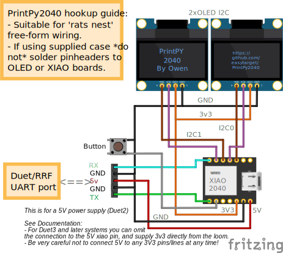

# HARDWARE GUIDE FOR PrintXIAO
## the the default PrintPY implementation

[](Case/exploded.png)

## Parts:
1. A SeeedStudio XIAO RP 2040 devboard
2. Two SSD1306 OLED I2C displays; the yellow/blue displays I use in my project work well, but any color display of the same size will work.
3. Hookup wire; thin.
4. (optional) A press Button; the design used here is quite common, the case has enough space to accomodate other types
5. (optional) A 5-pin du-pont socket strip, I had to cut down and trim a longer strip.
  * Alternatively you can have a direct wire from the PrintPY to the board, depending on needs.

You will also need a UART cable suitable for your board, the cable below is for a Duet2.
* The Duet3+ ranges use a different JST plug on the board. This has 3.3v available avoiding the need to bring 5V to the PrintPY, see the notes at the end of this document for more

## Case
The case needs care when slicing and printing, some of the clearances are very tight. use a slicer with adaptive layer height features to make sure the screens and PCB's fit correctly.

Print the upper case from neutral translucent material if you can. The onboard NeoPixel 'mood indiator' will then illuminate the whole body. You could also cut 'windows' in the case for illumination, or disable the mood lighting entirely in the config if not wanted.
- There are two upper case models included. One has a cutout allowing access to the XIAO USB-C port (for developing and debugging) while the other is a continuous shell and will probably print 'better' (fewer atrifacts in the translucent print) and grip in place more securely. ymmv.

The STL file has all the components included and orientented correctly, edit it in your slicer to select only the components you are going to print.
- There are two 'foot' designs included, one for freestanding use, the other is more suited to a frame mounting.

[](Case/front.png) [](Case/rear.png)

There are *three* case sizes, I used the 'slim' case, the only difference for the 'normal' and 'large' varients is that they add 2mm and 4mm (respectively) of additional depth (wiring space) between the screens and the Xiao/connections.
- I recommend using the 'normal' case, the slim design packs the hookup wiring *very* tightly and is hard to get cosed without springing back open (I eventually lightly glued mine together once I'd verified all the wiring, buttton etc).

### Important Construction Note:
Print the top case from a translucent material to allow the Neopixel and heartbeat LED's to be seen through the case.

You need to 'mask' the gap between the two OLED displays, otherwise this will look ugly with a bright light coming through the gap.
- Use a strip of opaque tape, I cut a strip of very ordiary black electrial tape for this.
- I then placed tape across all the exposed electronics on the back of the display to insulate them and then placed a strip of silver foil on that so that the NeoPixel is reflected back to maximize the lighting effect.

You also need to mask (or remove) the 'Super Brite!' 5V power LED on the Xiao board. This destroys the lighting effect otherwise.
- To be honest; Seeedstudio screwed up here. They put this very bright LED right next to the relatively dim RGB status LED that I use for a 'heartbeat' display. The RGB is essentially invisible when the board is running from a 5V supply.
- I cut and heat-formed a very small square of black plastic which is glued in place, this was fiddly since the LED also shines out sideways from it's package, so I had to make a 'cap' that fits over it.
- Desoldering it would be preferable, but it is in a very fiddly location and extremem cre would be needed, plus a good magnifier.

## Wiring 5V (Duet 2)


There is no PCB needed for this, the circuit should be wired + soldered directly in-place using thin hookup wire (this is fiddly, but possible)

## Connecting to Duet / RRF board.
PrintPY connects to the UART (serial) port on your board. It needs a Power Supply, ground and TX/RX connections.

[The documentation for the PanelDUE also gives a good overview of connecting serial to the Duet boards, there is a specific PanelDue `UART` socket on the Duet2 (wifi), and the `IO_0` socket on the Duet3 boards.

### Connection Looms; 5V (Duet)
Take care with wiring this, it is important that the 5V supply does not contact the (3v3) TX/RX lines! The connector allows the plug to be reversed to swap TX/RX lines quickly and safely.

#### Duet 2


#### Duet3

(Serial connection loom diagrams were generated by [wireviz](https://github.com/wireviz/WireViz) from the `.yaml` descriptions [here](Docs/wireviz_uart_duet2.yaml) and [here](Docs/wireviz_uart_duet3.yaml))

### 3.3V Looms
If you have a board with a 3.3v pin on the uart connector (like the Duet3) you can adapt the main wiring so it does not use 5V at all:
- Leave the 5V pin on the XIAO unconnected
- Bring the 3.3V power rail to the rear connector of the PrintPY in place of the 5V one
- Adapt the Duet3 loom (above) as needed..
- I leave this as an excercise for the reader..

## Alternate connections/deployments
The software is pretty modular; the OLED displays and NeoPixel are driven by self-contained classes. The main PrintPY code loop updates the local objetModel and then calls the lumen and display modules; the modules themselves decide what to display based on the current objectModel status.

It would be relatively easy to re-write the `output` and `lumen` modules for other displays and purposes.

### RP2040 I2C pins
If using an alternate RP2040 board please check the table below to determine which pins the I2C interfaces can be accessed on; and make sure the pins are correctly defined in the code.
```
I2C0 – SDA : GP0 / GP4 / GP8  / GP12 / GP16 / GP20
I2C0 – SCL : GP1 / GP5 / GP9  / GP13 / GP17 / GP21
I2C1 – SDA : GP2 / GP6 / GP10 / GP14 / GP18 / GP26
I2C1 – SCL : GP3 / GP7 / GP11 / GP15 / GP19 / GP27
```
