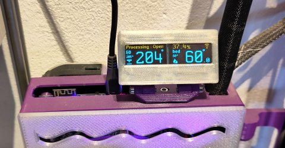

### Same Idea; different MCU

# Proudly Presenting the PrintPy.

This is a dedicated Output / Display device for 3d printers running RepRapFirmware v3.5.0 and later.`

It displays the current machine mode, current job status, network status, info messages and temperature plus status of the extruder and chassis heaters.
* Supports Single or Dual extruders.
* Supports Heated beds and Heated Chambers.
* Shows when a heater is in a fault state

It uses two OLED displays for it's output, and these can be configured to turn off automatically in certain states (eg `off`/`idle`).

There is a button on the rear of the unit; this can wake the display for a (configurable) time when pressed.

Wifi/Ethernet status is always displayed, and the rear button can be programmed to enable/disable the network on a long press.

Messages set by `M117` and `M291` are displayed in a scrolling box along with the machine state. Job progress is displayed when in progress or simulating.

The onboard NeoPixel on the XiAO board is used to flash the current status after each update; it changes color dependign on the printer 'mood', red = error.

# Hardware
This is designed to be a relatively simple build; needing soldering skills and care, but little more.

See the [HARDWARE](HARDWARE.md) document for more.

# Software
Code for the SeeedStudio XIAO RP2040 is in the [micropython](micropython) folder`

See the [micropython README](micropython README.md) document for install details..

