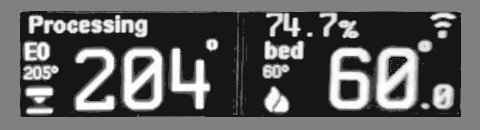

### Same Idea; different MCU
(this project is a 2024 re-working for my original, obsolete,  [PrintEYE](https://github.com/easytarget/PrintEye) project.)

# Proudly Presenting the PrintPy.

A dedicated Output / Display device for 3d printers running RepRapFirmware v3.4.0 and later.

It displays the current machine mode, current job status, network status, info messages and temperature plus status of the extruder and chassis heaters.
* Supports Single or Dual extruders.
* Supports Heated beds and Heated Chambers.
* Shows when a heater is in a fault state

It uses two OLED displays for it's output, and these can be configured to turn off automatically in certain states (eg *off* / *idle*).

There is a button on the rear of the unit; this can wake the display for a (configurable) time when pressed.

Wifi / Ethernet connection status is displayed, and the rear button can enable or disable the network as appropriate on a long press (configurable).

Messages set by `M117` and `M291` are displayed in a scrolling box along with the machine state.

Job progress is displayed when *processing*, *simulating*, *paused* etc.. The IP address or interface (error) status is displayed otherwise.

The onboard NeoPixel on the XiAO board is used to flash the current status after each update; it changes color depending on the printer 'mood':
- 🔴 Red for machine or network *errors*, 🟡 Yellow for *off*, 🟢 Green for *idle*, ⚪ White while *busy*, 🟣 Purple when *processing* jobs and 🔵 Blue for *paused* states.

# Hardware
This is designed to be a relatively simple build using commonly available inexpensive parts.

It needs some soldering and 3d printing skills, and care, but little more; there are no custom PCB's or parts.

An alternate, angled, 'foot' design with a mounting hole is included in the models; the upper case is printed from Neutral (translucent) material to allow the NeoPixel to be seen.

See the [HARDWARE](HARDWARE.md) document for a parts list, important construction notes, wiring diagrams and more.

# Software
Code for the SeeedStudio XIAO RP2040 is in the [micropython](microPython) folder.

The code represents the majority of the work needed to create this, the hardware is simple, the code less so. It is written in a well structured and modular way; the output is driven by self-contained classes that can be used as templates for alternative displays and hardware.

See the [micropython README](microPython/README.md) document for install and comissioning details; plus some architecture / development notes.
