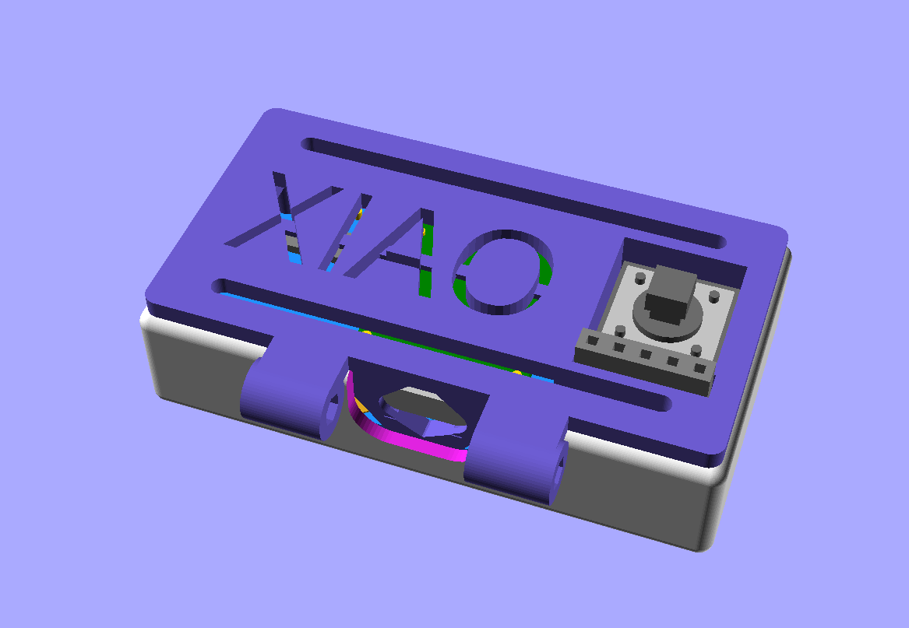

### Same Idea; different MCU

# Proudly Presenting the PrintPy.

**A Work In Progress!**

* the case is done and printed
* the XIAO RP2040 board is in place
* wiring is complete
* MICROPYTHON coding is ongoing.

# Hardware

## Case
The case needs care when slicing and printing, some of the clearances are very tight. use a slicer with adaptive layer height features to make sure the screens and PCB's fit correctly.
 

## Wiring


There is no PCB needed for this, the circuit should be wired + soldered directly in-place (this is fiddly, but possible)

## Connection
Take care with wiring this, it is important that the 5V supply does not contact the (3v3) TX/RX lines! The connector allows the plug to be reversed to revers TX/RX lines safely.

## Alternate connections/deployments
### RP2040 I2C pins
If using an alternate RP2040 board please check the table below to determine which pins the I2C interfaces can be accessed on; and make sure the pins are correctly defined in the code.
```
I2C0 – SDA : GP0 / GP4 / GP8  / GP12 / GP16 / GP20
I2C0 – SCL : GP1 / GP5 / GP9  / GP13 / GP17 / GP21
I2C1 – SDA : GP2 / GP6 / GP10 / GP14 / GP18 / GP26
I2C1 – SCL : GP3 / GP7 / GP11 / GP15 / GP19 / GP27
```
