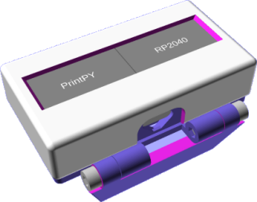
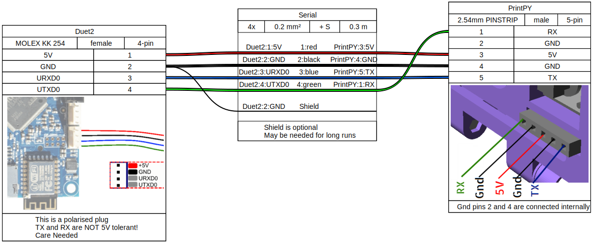

### Same Idea; different MCU

# Proudly Presenting the PrintPy.

**A Work In Progress!**

* the case is done and printed
* the XIAO RP2040 board is in place
* wiring is complete
* code requirements are in place
  * SerialOM for communications
  * MicroPython EZ fonts for the display
* Code is in progress; new for alpha3
  * chamber + multi-extruder support works
  * messages work but without marquee
  * Needs message marquee, info screens, wifi toggle


See the [README](microPython/README.md) in the '[microPython](microPython/)' folder for more.

# Hardware
This is designed to be a relatively simple build; needing soldering skills and care, but little more.
[](Case/exploded.png)

## Parts:
1. A SeeedStudio XIAO RP 2040 devboard
2. Two SSD1306 OLED I2C displays; the yellow/blue displays I use in my project work well, but any color display of the same size will work.
3. Hookup wire; thin.
4. (optional) A press Button; the design used here is quite common, the case has enough space to accomodate other types
5. (optional) A 5-pin du-pont socket strip, I had to cut down and trim a longer strip.
  * Alternatively you can have a direct wire from the PrintPY to the board, depending on needs.

You will also need a UART cable suitable for your board, the cable below is for a Duet2.
* The Duet3+ ranges use a different JST plug on the board. This has 3.3v available avoiding the need to bring 5V to the PrintPY

## Case
The case needs care when slicing and printing, some of the clearances are very tight. use a slicer with adaptive layer height features to make sure the screens and PCB's fit correctly.

[](Case/front.png) [](Case/rear.png)

## Wiring 5V (Duet 2)


There is no PCB needed for this, the circuit should be wired + soldered directly in-place (this is fiddly, but possible)

## Connecting to Duet / RRF board.
PrintPY connects to the UART (serial) port on your board. It needs a Power Supply, ground and TX/RX connections.

[The documentation for the PanelDUE also gives a good overview of connecting serial to the Duet boards, there is a specific PanelDue `UART` socket on the Duet2 (wifi), and the `IO_0` socket on the Duet3 boards.

### Connection Looms; 5V (Duet)
Take care with wiring this, it is important that the 5V supply does not contact the (3v3) TX/RX lines! The connector allows the plug to be reversed to swap TX/RX lines quickly and safely.

#### Duet 2


#### Duet3

(Serial connection loom diagrams were generated by [wireviz](https://github.com/wireviz/WireViz) from the `.yaml` descriptions [here](Docs/wireviz_uart_duet2.yaml) and [here](Docs/wireviz_uart_duet3.yaml))

### 3.3V Looms
If you have a board with a 3.3v pin on the uart connector (like the Duet3) you can adapt the main wiring to not use 5V at all, bring 3.3V to the rear connector of the PrintPY, and adapt the Duet3 loom (above) as needed..
- I leave this as an excercise for the reader..

## Alternate connections/deployments
### RP2040 I2C pins
If using an alternate RP2040 board please check the table below to determine which pins the I2C interfaces can be accessed on; and make sure the pins are correctly defined in the code.
```
I2C0 – SDA : GP0 / GP4 / GP8  / GP12 / GP16 / GP20
I2C0 – SCL : GP1 / GP5 / GP9  / GP13 / GP17 / GP21
I2C1 – SDA : GP2 / GP6 / GP10 / GP14 / GP18 / GP26
I2C1 – SCL : GP3 / GP7 / GP11 / GP15 / GP19 / GP27
```
