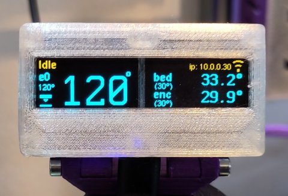

# Micropython code
PrintPY is coded in [MicroPython](https://micropython.org/); and is intended to be uploaded by the user from a suitable IDE (tested with Thonny, but ViperIDE is also nice for more experienced developers).

* If this is new to you I suggest you start with the [XIAO2040 micropython guide](https://wiki.seeedstudio.com/XIAO-RP2040-with-MicroPython/) from SeeedStudio, and use [**Thonny**](https://thonny.org/) as an IDE.
 * You do not need to know Python programming, updating the firmware is drag-n-drop in your file manager, the IDE's are easy to use.
* [**Viper IDE**](https://viper-ide.org/) is also excellent; it runs from the web directly in your web browser without needing to be 'installed'.

Just as the Hardware document assumes you can 3d Print, solder and read a wiring diagram; this document assumes you can follow the guides, set up and connect to your device without needing super detailed instructions here; the guide above will show you what you need.

# RRF config:
You need to set up the second serial (UART) port on your printer to 'no CRC/checksum, 230400 baud'.
* For testing you can use the console to send:
* `M575 P1 B230400 S0`
* For a Duet2 or 3 machine using the default (panelDue) UART interface your `config.g` needs to include that line.
  * This can normally go after the USB port setting (*M575 P0 ....*) line.
  * Later Duet models have additional UART ports that could be used; you will need to adjust ['M575'](https://docs.duet3d.com/User_manual/Reference/Gcodes#m575-set-serial-comms-parameters) as necesscary for them.
* Do not change the `S0` parameter; PrintPY is not compatible with CRC or Checksumming.

# RP2040 MicroPython Firmware:
Hold the 'boot' button on the XIAO board while connecting it to a USB port on your computer; it will appear as a new disk drive (just like a USB thumb drive).
* Flash with the Firmware `.uf2` file in the 'Firmware' folder by dragging and dropping that onto the XIAO drive. The XIAO will pause for a few seconds ingesting the file, then reboot.
  * ..or you can use a later firmware from the main MicroPython site
  * the version in this repo is the Firmware I have tested with
* After sucessfully flashing you should see the REPL console of the device in your IDE:
```python
  MicroPython v1.24.0 on 2024-10-25; Raspberry Pi Pico with RP2040
  Type "help()" for more information.
  >>> 
```
# Installing:
Upload all the `.py` files from this directory onto the root folder of your device in the IDE; also copy the fonts directory to 'fonts'.
* The 'Firmware' folder should not be copied; nor does the README.

## Initial Configuration:
Copy `config-default.py` to `config.py` on the device.
* If you are using alternate hardware pins etc. you will need to adjust the hardware config definitions here
* See the [config](#Config) section below for more.

# Test Hardware:
*Note: The hardware test script will read its configuration from the config file we created above.*
* Run `hwTest.py`:
```console
Testing printXIAO comms, screen, pixel and button
UART initialised
Button present on: GPIO2
sent: M122
recieved: b'{"seq":28720,"resp":"=== Diagnostics ===\\n"}\n{"seq":28721,"resp":"RepRapFirmware for Duet 2 WiFi/Ethernet version 3.5.4 (2024-11-24 10:43:42) running on Duet WiFi 1.02 or later\\n"}\n{"seq":28722,"resp":"Board ID: UUID\\n"}\n{"seq":28723,"resp":"Used output buffers: 3 of 26 (16 max)\\n"}\n'
button: Pressed
sent: M122
recieved: b'{"seq":28810,"resp":"=== Diagnostics ===\\n"}\n{"seq":28811,"resp":"RepRapFirmware for Duet 2 WiFi/Ethernet version 3.5.4 (2024-11-24 10:43:42) running on Duet WiFi 1.02 or later\\n"}\n{"seq":28812,"resp":"Board ID: UUID\\n"}\n{"seq":28813,"resp":"Used output buffers: 3 of 26 (16 max)\\n"}\n'
sent: M122
..etc..
```
* You should see the OLED displays outlined and showing 'left' and 'right' as appropriate; the NeoPixel shuld be cycling R->G->B, if you press the button you should see a 'button: pressed' message on the REPL console.
* The script sends [`M115`](https://docs.duet3d.com/User_manual/Reference/Gcodes#m115-get-firmware-version-and-capabilities) every few seconds to the connected RRF machine; and then returns the (JSON encoded) output to the REPL console:

If you do not see any serial output the first thing to do is test (swap) the polarity of the RX and TX lines by reversing the connector on the PrintPY.
* The second thing to test is that both the PrintPy and RRF controller have the baud rate configured properly.

If you see:
```console
Failed to start displays!
[Errno 5] EIO
```
..this indicates a wiring or configuration problem with the OLED displays, the I2C controller is failing to get a response from them during initialisation.

# Commissioning:
Once the test script is running correctly you can try running `printXIAO.py`. You should now see a brief splash-screen and then the current printer status displayed. On the console you should see:
```console
printXIAO is starting
UART initialised
starting output
connected to ObjectModel
button present on: GPIO2
PrintPY::printXIAO is running
[519ms, 112000b] Up: 3d:12h:52:47 | Off | ip: 10.0.0.30
[504ms, 112000b] Up: 3d:12h:52:48 | Off | ip: 10.0.0.30
[505ms, 112000b] Up: 3d:12h:52:49 | Off | ip: 10.0.0.30
etc..
```
The (default configured) status lines show:
* [Fetch cycle time, free memory after fetching and collect()ing]
* Uptime reported by the Controller firmware
* Main status | Wifi Status | Job Progress (if any) | System messages (if any)

The Neopixel will be flashing with the printer 'mood', the heartbeat LED should be cycling as requests are sent.

## Dealing with multi-thread reset errors on the RP2040!
This is annoying; the RP2040 micropython port does not handle multi-cpu systems properly when they have threads running on the second CPU.

*Once the main printXIAO code is running you can interrupt the main loop by pressing **ctrl-c** in the REPL console, but this fails to fully 'soft reset' the board.*
1) *'Crtl-c' in the repl console should be followed immediately by running `micropython.reset()` to fully reset the hardware.*
2) *or Press the reset button on the XIAO board (it's tiny and hard to access, especially once the wiring is done, use a small non-conductive plastic rod to do this)*
3) *or Force the reset by unplugging it completely from the printer and usb-c.*

*If you do not do this there is a high chance the board will quickly stop responding to REPL commands; it gets into some sort of bad USB state. This plagued me during the last stages of development.*

# AutoStart at boot
Enable running at boot time by editing the last four lines of the config as described in the comments. Then mount on your machine, close the case, and enjoy seeing your printers status at-a-glance.

*Once Autostart is enabled the multi-thread errors discussed above are more serious since the code is starting automatically. The solution is pressing **ctrl-c** quickly after the reset/reboot, before the main code loop starts. This is why there is a startup countdown, to give console users a chance to interrupt the code *before* the second CPU thread starts.*

# Architecture
`printXIAO.py` is the main program; it runs a continual loop that queries the RRF controller to fetch the current objectModel (machine state). It then calls two output class modules to display data from the objectModel:
- `lumenXIAO.py` : Shows the controller status using the onboard NeoPixel on the Xiao RP2040 board.
- `heartbeatXIAO.py` : Shows a communication 'heartbeat' using the auxillary RGB led on the board.
- `outputI2Cx2.py` : Displays the machine state on a twin OLED display, showing the overall status; current temperatures and heater statuses; job status (when active), messages and network status.
  - The display is built entirely out of fonts (using symbol fonts where necesscary) and uses my own microPython fonts, font writer and marquee.
  - Single or Twin extruders are supported, as are systems with enclosures.



# Requirements:
There are no external dependencies or requirements needed, this folder contains the `printXIAO` code itself and all the libraries it uses.

### SerialOM
Development of the communications code happens in the `serialOM` repo:
https://github.com/easytarget/serialOM

### EZfont Libraries and fonts are in the `fonts` folder
Development of the Font display system (Font Writer, Marquee and the Fonts themselves) happens in the `microPyEZfonts` repo:
https://github.com/easytarget/microPyEZfonts

## Config
As noted above, you need to copy `config-default.py` to `config.py` in the root folder of your device.

Then make any changes you might want.
* See the comments in the config file.
* There are not many 'user options' to play with, and the defaults are set up sensibly for the XIAO 2040 board used here.
* You can set the list of states where the Display should turn off:
  * OLED displays can [burn in](https://forum.makerforums.info/t/oled-display-burn-in-the-evidence/90223) if left on all the time, making the output look reaaly ugly!
  * Turning the displays off when the Printer is `off` is a very good idea.
  * If your printer is permanently on it may be a good idea to add `[idle]` as well as `[off]` to the list of screen off states.
* Another important option here is the Baud rate for the serial port; you must match the speed with the speed configured on your controller. The default baud rate for PrintXIAO is 230400 baud, no parity.
* Only mess with the Hardware settings if you are using alternate wiring or boards etc..
* Do not try to 'speed up' the main (once per second by default) fetch/update cycle too much, the cpu needs at least 500ms to do each fetch cycle, plus 150ms to render the updates to the display panels.
* NeoPixel and display brightnesses can be set, you may want to reduce these in a dark workshop. You can set a different brightness for 'off states'.
* The default network interface can be defined (for controllers with more than one) as can the default commands sent to enable/disable the network.
